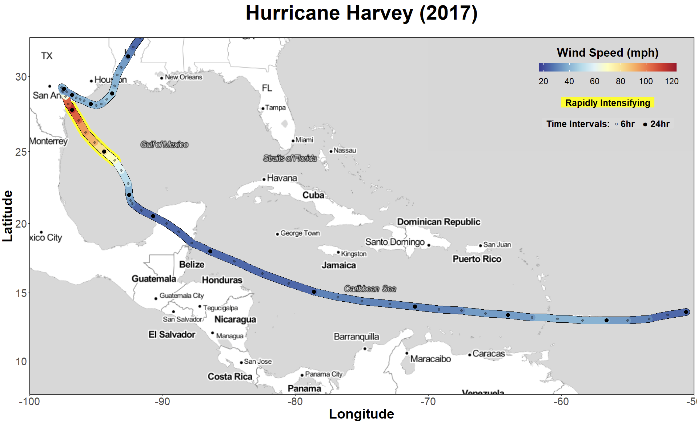
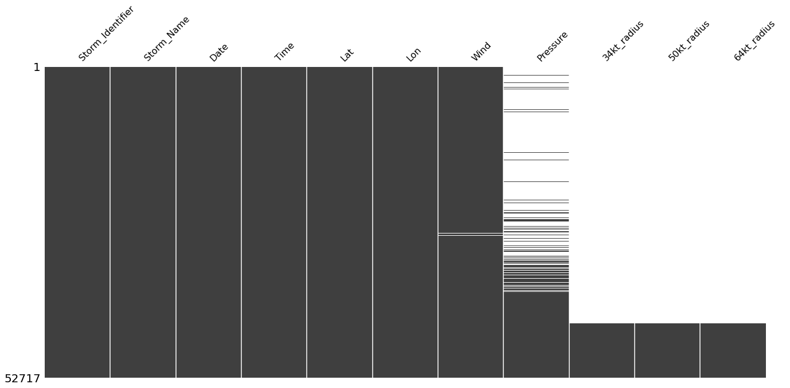
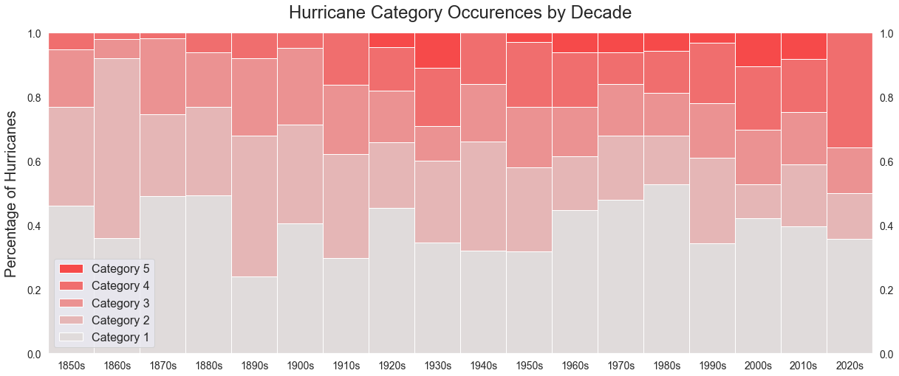
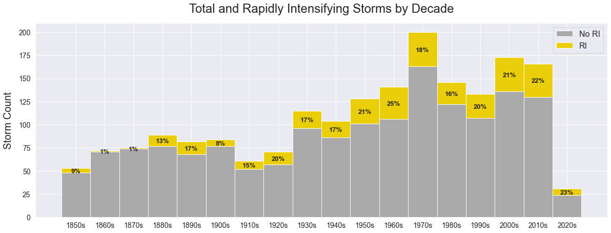

```{r, setup, include=FALSE}
knitr::opts_chunk$set(echo = FALSE,out.width = "60%", 
               fig.align = "center")
options(knitr.table.format = function() {
  if (knitr::is_latex_output()) 'latex' else 'pandoc'
})
```

```{r, include=FALSE, echo=FALSE}
library(knitr)
library(magick)
```

{width=90%}

## 1. Introduction

By the end of 2020, the global mean temperature reached 1.2 °C above the pre-industrial baseline. With international climate efforts continuing to miss key benchmarks, there remains little hope of limiting global mean temperature rise below 2 °C. One consequence already visible is excess heat absorption in the hydrosphere, increasing the risk of Caribbean hurricanes, which draw their strength directly from the warm Atlantic water. Recent scientific literature has placed renewed focus on a hurricane characteristic called *rapid intensification*. According to the National Hurricane Center, a hurricane undergoes rapid intensification when the maximum wind speed increases by 30 knots (or 35 m.p.h.) in 24 hours. With reduced lead times for safety measures, rapidly intensifying hurricanes present an exceptional risk to life and property. This report uses exploratory data science and machine learning methods to investigate and predict rapidly intensifying storms forming in the Atlantic Ocean. The remainder of the paper is divided into five sections, Problem Statement and Background, Data, Analysis, Results, and Discussion.

## 2. Problem Statement and Background

Comprehensive analysis of meteorological trends has produced consensus in the scientific community: warming from climate change has led to an increase in the frequency and intensity of hurricanes [@Emanuel;@Elsner;@Mudd]. Despite this, there remains much that scientists do not understand about hurricanes. Even less understood are *rapidly intensifying hurricanes*, which have gained attention and concern recently as most of the destructive hurricanes of the 2010s experienced a rapid intensification event close to landfall. Recent work published by Balaguru @Balaguru and Guimond @Guimond uses advanced meteorological models to analyze and predict rapidly intensifying hurricanes. Our analysis builds off a growing body of knowledge, utilizing data science and machine learning to investigate factors that influence rapid intensification events.

The body of literature concerning rapid intensification has grown considerably in recent years. In the early 2000s, research focused on individual case studies, where scientists worked to determine what factors caused a storm to rapidly intensify. Studies of Hurricane Opal (1995) @Bosart, Wilma (2005) @Chen, and Earl (2010) @Rogers were pivotal to the development of the field, setting the stage for new types of analysis. In the past decade, increases in computing power have allowed researchers to investigate macro-level trends, using complex models to identify the larger causes of rapid intensification. New research by Zhang and Kanada has largely confirmed earlier discoveries, that rapid intensification is highly correlated with warm sea surface temperatures and low wind shear, among other factors [@Zhang;@Kanada]. Despite increased understanding, models have remained poor at predicting the occurrence of rapid intensification events. The models used to predict rapid intensification have predominantly been meteorological models, which use a host of variables to simulate weather. However, there were no studies found that chose to focus on data science and machine learning methods, rather than meteorological ones.

## 3. Data

### 3.1 HURDAT2 and Other Data Sources

The National Hurricane Center (NHC) produces and maintains the Hurricane Databases (HURDAT), which is divided into separate databases for Atlantic and Eastern Pacific cyclones, respectively. This project only considers the Atlantic database, which contains information on storms dating back to 1851. In 2013, the NHC reformatted the database and released HURDAT2, which is the primary data source for this analysis. In total, this data set contains 1,924 meteorological events, including tropical disturbances, depressions, lesser cyclones, and hurricanes.

The HURDAT2 file is freely available in CSV format on the NHC website. Each row of the database contains geographic and meteorological data for a single observation of a storm, provided in 6-hour intervals. Thus, the unit of analysis is a six-hourly observation of the current conditions for a given storm. Each observation contains information on the date, location, wind speed, pressure, and size of the storm. For its 1,924 storms, HURDAT2 contains approximately 52,000 individual observations, an average of 27 observations per storm.

Unfortunately, the HURDAT2 data is not complete for every variable. Upon creation in the mid-1970s, the NHC used a range of sources, including NASA and other NOAA divisions, to backfill historical data. This means that, in addition to missing data, there is likely significant measurement error for data collected before this changeover. Figure 2 shows the distribution of missing data in HURDAT2. As shown, reliable barometric pressure data became available for larger hurricanes in the mid-1970s and all storms by the 1990s. In 2013, the NHC began recording the wind speed radii of storms. 

{width=80%}

This analysis also uses raster image data from the NOAA Coral Reef Watch and the Cooperative Institute for Meteorological Satellite Studies at the University of Wisconsin, Madison. These sources provide daily satellite images used to estimate sea surface temperature and wind shear at specific geographic coordinates.

### 3.2 Dependent Variable

As this analysis focuses on rapid intensification, the dependent (or outcome) variable used for modeling must identify which cyclones experienced rapid intensification. Such information is not provided by HURDAT2, so this variable was constructed manually using the NHC definition of rapid intensification (recall that this is defined as a 30+ knot increase in maximum wind speed in 24 hours). Several versions of the outcome variable were considered, including using only those rapid intensification events that occurred close to land, or only those in storms that reached a certain wind speed. However, in such cases, there were too few positive outcomes (i.e. storms that rapidly intensified) to run a substantial model. 

Due to difficulties with time-series forecasting and for the sake of simplicity, the machine learning algorithm will predict whether a storm will undergo rapid intensification based solely on a single observation of the storm. Therefore, the outcome variable for rapid intensification is defined as True if the storm reached the rapid intensification threshold within the next 24 hours, and False otherwise. Recall that the units of analysis are observations taken at 6-hour intervals. Thus, for each observation, the outcome variable is defined independently, based on whether the storm will rapidly intensify within 24 hours of the observation.

### 3.3 Independent Variables

A range of temporal, geographic, and meteorological variables was used to predict the outcome variable. A majority of these predictor variables were either taken directly or calculated from the HURDAT2 database. Table 1 below gives information about each of the independent variables used in the machine learning pipeline. In some cases, the variable had to be calculated using existing data values. For example, *Wind Speed Acceleration* was not a variable available in the HURDAT2 data set, but can easily be calculated using the current and previous wind speed and time.

\begin{table}[]
\begin{tabular}{|l|l|l|c|}
\hline
\textbf{Variable}            & \textbf{Type}  & \textbf{Source}  & \multicolumn{1}{l|}{\textbf{Calculation Required?}} \\ \hline
Time of Day                  & Temporal       & HURDAT2          &                                                     \\ \hline
Day of Year                  & Temporal       & HURDAT2          & Yes                                                 \\ \hline
Latitude                     & Geographical   & HURDAT2          &                                                     \\ \hline
Longitude                    & Geographical   & HURDAT2          &                                                     \\ \hline
Maximum Sustained Wind Speed & Meteorological & HURDAT2          &                                                     \\ \hline
Wind Speed Acceleration      & Meteorological & HURDAT2          & Yes                                                 \\ \hline
Wind Speed Radii             & Meteorological & HURDAT2          & Yes                                                 \\ \hline
Minimum Barometric Pressure  & Meteorological & HURDAT2          &                                                     \\ \hline
Eye Bearing                  & Meteorological & HURDAT2          & Yes                                                 \\ \hline
Eye Speed                    & Meteorological & HURDAT2          & Yes                                                 \\ \hline
Sea Surface Temperature      & Meteorological & NOAA             & Yes                                                 \\ \hline
Wind Shear                   & Meteorological & SSEC - Wisconsin & Yes                                                 \\ \hline
\end{tabular}
\caption{Independent Variables Considered for Modelling}
\end{table}

### 3.4 Challenges

The greatest challenge of this project was the collection of sea surface temperature (SST) and wind shear data. The challenge arises because the model needs these values for a specific time and location, specifically the eye of the storm for a given observation. Most SST datasets either provide this data at a set location (i.e. an anchored buoy) or without the required resolution (weekly, rather than daily). The NOAA Coral Reef Watch succeeds in both of these metrics, providing complete geographic coverage with daily resolution. Unfortunately, this data is only available in the form of daily JPEG images.

For obvious reasons, comparing the pixel color value against the in-map scale to estimate temperature for given geographic coordinates is not the cleanest solution. However, it was determined to be an acceptable method for several reasons. First, the NOAA images were free and easy to access. Second, all 13,471 of the daily images, from 1985 to 2021, have identical formatting, ensuring consistent and accurate pixel identification. Lastly, it was estimated that using set location data or weekly sources would have a higher measurement error than reading pixel data.

While the NOAA SST data extraction was successful, the wind shear images from Wisconsin were not of sufficient quality and formatting to overcome potentially significant measurement errors. Thus, the wind shear data is not included in any of the models. This is quite unfortunate as much of the recent literature of the last five years predicts that wind shear may have a far larger impact than previously thought, potentially even more than sea surface temperature. Alternate solutions to the wind shear problem are considered further in the Discussion section.

## 4. Analysis

### 4.1 Tools

For this project, the analysis was conducted in a Jupyter Notebook with Python 3.9.9, using primarily the pandas and scikit-learn modules (for data preparation and modeling, respectively). Visualizations were created with seaborn and ggplot. All code is available at the Github repository linked in the Appendix.

### 4.2 Create Additional Predictor Variables

After loading the HURDAT2 data, the other predictor variables from Table 2 must be calculated. One of these variables is *Wind Speed Acceleration* or the average change in knots per hour since the previous observation. This presents potential modeling issues, as the definition of rapid intensification (30-knot wind speed increase in 24 hours) is also a measure of wind speed acceleration. To account for the potential probability that the *Wind Speed Acceleration* variable dominates, models were run both with and without the acceleration variable.

Other predictors requiring additional calculation were the *Eye Speed* and *Eye Bearing.* While HURDAT2 records the wind speed, it does not record the speed of the center of the storm over land, something that may be correlated with rapid intensification. The pyproj module provides an easy platform for great circle calculations, using the geographic coordinates of two concurrent observations to find the bearing and distance traveled by the storm.

### 4.3 Modeling

The machine learning components of this analysis are conducted with scikit-learn, Python’s machine learning module. The models were created using a pipeline that integrates data preprocessing and modeling procedures. The pipeline serves to automate parts of the machine learning workflow, allowing multiple types of classifiers and tuning parameters to be tested at once. Additionally, the scikit-learn pipeline provides tools for cross-validation and model selection. Cross-validation is a statistical method that estimates the ability of a classifier to understand the data when using a limited sample size. Cross-validation is an important component of the machine learning pipeline, allowing for the best model to be selected by creating additional training samples, rather than using the all-important test data. This analysis uses the k-fold cross-validation method, which divides the predictors into $k$ training subsets, or folds, which are tested and averaged to score the different models and tuning parameters. 

### 4.3.1 Classifiers and Tuning Parameters

This project tests four different classifiers, naive Bayes, k-nearest neighbors, decision tree, and random forest to determine which is best for understanding hurricane rapid intensification. Some of these classifiers use additional tuning parameters to fine-tune the model.

The first of the four classifiers, naive Bayes, is the simplest. This classifier uses Bayes’ theorem to estimate probabilistic outcomes based on the (naive) assumption that the predictor variables are independent of each other (which of course they are not). The naive Bayes classifier uses no tuning parameters, meaning there is only one version of the model to test. Second is the k-nearest neighbors classifier, which uses a distance metric to identify the closest neighbors of a test observation in the training set. Then, the test observation is classified based on the majority classification of its k-nearest neighbors. This classifier uses the tuning parameter k as the number of neighbors of interest when classifying.

The next classier is the decision tree, which works by splitting (or branching) training observations based on specific criteria (e.g. wind speed greater than 100 knots). Then, similar to the previous classifier, the test observation is predicted to have the most common classification of training observations within the final branch. This classifier uses maximum depth as a tuning parameter, that is the maximum number of branching levels. The last classifier, random forest, is an expansion of the decision tree classifier. A random forest model creates multiple decision trees using training data subsets with a random assortment of predictor variables. Then, a test observation is classified by averaging the predictions across all trees. The random forest model is tuned using maximum depth (the same as the decision tree) and the number of trees (estimators) in the forest.

### 4.3.2 Evaluation Metric

Modes were evaluated with a receiver operating characteristic (ROC) curve, which shows the performance of the model at varying levels of classification. The scores for each model were assigned based on the AUC (or area under the curve) metric, which is equal to the integral of the ROC curve.

## 5. Results

### 5.1 Macro Trends

In concurrence with @Kossin and @Saunders, Figure 3 shows that the proportion of hurricanes reaching Category 3, 4, or 5, or ‘major status’ has increased in recent decades. Note that the 2020 decade only contains information about a single hurricane season. These ‘major’ hurricanes are more likely to cause significant damage and death and thus are the most important to understand and predict. Though it is beyond the scope of our analysis, other works [@Elsner;@Mudd] have shown that this increase is highly likely to be caused by increasing ocean temperatures as a result of anthropogenic climate change. Without drastic steps to alleviate ocean warming, it is expected that the rate of Category 4 and 5 hurricanes will continue to rise.

{width=100%}

Further analysis examined the proportion of hurricanes achieving rapid intensification status by decade. Again, the results in Figure 4 concur with the work of @Kossin and @Benedetto, who demonstrated that the proportion of rapidly intensifying hurricanes has steadily increased over the last 150 years. The increased rate of rapidly intensifying hurricanes as a result of climate change will likely prove to be a major policy problem for the United States over the coming decades. The increase in nominal damages caused by hurricanes has already skyrocketed in the last 20 years @Bjarnadottir.

{width=100%}

 
### 5.2 Machine Learning Model

As noted earlier, there was concern that the inclusion of the *Wind Speed Acceleration* variable would overwhelm the model, since rapid intensification is also a measure of acceleration. To account for this, two models were run simultaneously: Model A, which included the *Wind Speed Acceleration* variable, and Model B, which did not. The other independent variables included were identical for both of the models: *Pressure, Wind Speed, Eye Speed, Eye Bearing, SST, Day of the Year, Latitude, Longitude*, and ln *50kt radius*. The other independent variables from Table 1 were tested as well but had a negligible impact on the effectiveness of the model. The results of the two models run with the testing data are presented below.

The pipeline tested four different classifiers and a wide range of tuning parameters, as described in Section 4. The most effective classifier for both Model A and Model B was the Random Forest method. With varying parameters, (Model A used 18 depth and 1500 estimators, while Model B had 20 and 500) both models received high accuracy when predicting the dependent variable. The accuracy scores were skewed, however, as the vast majority of the observations had 0 as an outcome (no rapid intensification event). To combat this, confusion matrices are displayed for both models in Figure 5. A confusion matrix plots the predicted values against the true values for both possible outcomes, showing where the model's correct guesses are coming from. Both models performed similarly and surprisingly well, Model A predicted 93.2% of the total outcomes correctly, but more importantly, it correctly predicted 77.9% of the positive outcomes. Similarly, Model B, which did not use the acceleration variable, correctly predicted 92.1% of the total and 79.6% of the positive outcomes. Both models have very similar accuracy scores, but they are alike in more ways than one.

```{r, echo=FALSE,out.width="40%", out.height="40%",fig.cap="Confusion matricies showing the accuracy of Model A (left) and Model B (right)",fig.show='hold',fig.align='center'}

img <- image_read("images/cona.png")
img_with_border <- image_border(img, "white", "30x0")
image_write(img_with_border, "images/conaa.png")

img <- image_read("images/conb.png")
img_with_border <- image_border(img, "white", "30x0")
image_write(img_with_border, "images/conbb.png")

knitr::include_graphics(c("images/conaa.png","images/conbb.png"))
``` 

Permutation importance is a useful tool for model interpretation By removing variables one at a time (permutation), the relative change in model accuracy provides information on that variable's importance. The results of permutation importance tests for Models A and B are displayed in Figure 6. As hypothesized, the *Wind Speed Acceleration* variable dominates Model A, providing most of the predictive value. However, the relative order and importance of all the other independent variables are nearly identical in both models. Without an acceleration variable, the other independent variables in Model B made up and supplied the predictive power to give the models relatively equal accuracy.   

```{r, echo=FALSE,out.width="49%", out.height="49%",fig.cap="Variable importance for Model A (left) and Model B (right)",fig.show='hold',fig.align='center'}
knitr::include_graphics(c("images/pia.png","images/pib.png"))
``` 

Overall, both Model A and Model B performed admirably. Despite Model A having the *Wind Speed Acceleration* variable, it did not perform significantly better than Model B, nor did the relative importance of the other variables change. This suggests that the general model is robust, as a major change in the specification did not have a significant impact on the results. The theoretical implications for these models are large, as the ability to predict rapidly intensifying hurricanes has the potential to save many lives. However, there are challenges when it comes to the time interval of prediction. Predicting a rapid intensification event only 6 hours before it happens is interesting but hardly useful. Meanwhile, a correct prediction 48 hours in advance has the ability to save lives. Future analysis should consider how these predictions changed accuracy based on the number of hours it was until the rapid intensification event occurred.

## 6. Discussion    

I would consider this project an overwhelming success. I set out to investigate rapid intensification while also growing my experience in geospatial analysis and data visualizations. I am proud of the visualizations I produced and the understanding I gained from moving back and forth between R and Python often. Multi-language fluency is a skill I hope to keep improving on. This project has also grown my interest and excitement about geospatial data analysis. One of my biggest takeaways is the importance of well-organized data set; the NHC format and documentation provided an excellent data cleaning experience, leaving more time for analysis and visualization with fewer headaches. Had I more time, I would certainly search for high-quality wind shear data, as new research suggests that it may be of critical importance for hurricane intensity. As well, including other meteorological variables would only serve to make the more model applicable for hurricane prediction.

\newpage

# Appendix:

**Github Repository:** https://github.com/SamLeBlanc/Hurricane-RI-Analysis

# Data Sources:

**NHC Data Archive:** https://www.nhc.noaa.gov/data/

**NOAA Coral Reef Watch:** https://coralreefwatch.noaa.gov/


# Works Cited:


  
.
  
